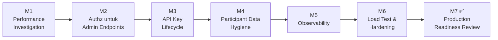

# Plan Pengerjaan — `Approval-Engine-Service`

Disusun setelah integrasi `asset-system-service` (main backend) selesai sampai Milestone 7
([lihat asset-system-service/docs/backend-milestones.md](../../asset-system-service/docs/backend-milestones.md)).
Dokumen itu berisi beberapa temuan nyata dari sisi *consumer* yang jadi input utama plan ini —
bukan asumsi, tapi hasil pengujian end-to-end sungguhan terhadap engine ini.

## Temuan dari sisi consumer (asset-system-service) yang relevan

1. **Latensi `POST /requests` ≈ 2.1 detik**, diukur langsung ke endpoint ini (bukan lewat
   consumer) — signifikan untuk endpoint yang dipanggil sinkron di jalur create request main
   backend. Dugaan: beberapa round-trip Turso sekuensial per create (resolve workflow →
   resolve participant/resolver → insert request + steps + assignments).
2. Satu `WorkflowStep` cuma punya **satu** `condition` — consumer terpaksa memecah jadi 2
   `doc_type` (`asset_request_barcode`, `asset_request_field_device`) untuk mengakali ini.
   Kalau ada consumer lain dengan kebutuhan kombinasi kondisi lebih kompleks, keterbatasan ini
   akan terasa lagi.
3. `POST /participants/import` **tidak** digerbangi `X-API-Key` (beda dari `POST /requests`) —
   README sendiri menyebut workflow/application management "no role gate yet", tapi endpoint
   participant import ikut tidak ter-gate juga meski bisa menimpa data organisasi milik semua
   consuming app.
4. Tidak ada endpoint untuk menonaktifkan/rotasi `api_key` sebuah `Application` — consumer
   yang perlu rotasi key harus registrasi ulang (`code` baru atau sama), key lama tetap valid
   selamanya karena tidak ada mekanisme revoke.
5. DB engine (Turso terpisah) sudah terisi banyak data sisa smoketest/E2E lama
   (`AST-E2E-*`, `REQ-E2E-*`, `SUP-E2E-*`) yang ikut muncul di `GET /participants` — tidak
   berbahaya secara fungsional (resolver `role` bisa saja ambil orang yang salah kalau posisi
   sama), tapi mengotori data produksi kalau tidak dibersihkan sebelum go-live.

## Milestone

### Milestone 1 — Performance Investigation

**Tujuan:** turunkan latensi `POST /requests` dari ~2.1s ke angka yang wajar untuk endpoint
sinkron (target awal: <500ms p95 — sesuaikan setelah profiling).

**Tasks:**
- [ ] Profile `service/engine.go` (`CreateRequest`) — hitung berapa query/round-trip Turso
      terjadi per call (workflow lookup, resolver per step, insert request+steps+assignments).
- [ ] Identifikasi query yang bisa digabung jadi satu round-trip (batch insert steps +
      assignments dalam satu statement/transaction, bukan loop per step).
- [ ] Cek apakah koneksi ke Turso di-reuse (connection pooling) atau dibuka baru tiap request.
- [ ] Ukur ulang latensi setelah tiap perbaikan, catat angka before/after.

**DoD:** latensi `POST /requests` terukur turun signifikan (target konkret ditentukan setelah
profiling awal), didokumentasikan dengan angka before/after.

### Milestone 2 — Authorization untuk Admin Endpoints

**Tujuan:** tutup gap yang sudah diakui sendiri di README ("no role gate yet") untuk
`applications`, `workflows`, dan (temuan baru) `participants/import`.

**Tasks:**
- [ ] Tambahkan `is_admin` check (atau API key admin terpisah) untuk
      `POST/GET /applications`, `POST/GET /workflows`, `POST /workflows/:id/deactivate`.
- [ ] Gerbangi `POST /participants/import` juga — saat ini siapa pun yang tahu URL bisa
      menimpa data organisasi semua consuming app tanpa autentikasi apa pun.
- [ ] Definisikan siapa yang boleh dapat kredensial admin ini (tim system-support sesuai
      README) dan bagaimana didistribusikan.

**DoD:** endpoint admin menolak request tanpa kredensial admin yang valid; endpoint yang
dipakai consuming app (`POST /requests`, `/decision`, dll) tidak terpengaruh.

### Milestone 3 — API Key Lifecycle

**Tujuan:** consuming app bisa rotasi/mencabut `api_key` tanpa registrasi ulang application
baru.

**Tasks:**
- [ ] `POST /applications/:id/rotate-key` — generate `api_key` baru, key lama langsung invalid.
- [ ] `POST /applications/:id/deactivate` — nonaktifkan application (dan seluruh key-nya)
      tanpa menghapus riwayat request yang sudah ada (`FindByResource`/audit tetap harus
      bisa baca data lama).
- [ ] Update dokumentasi consumer (`asset-system-service/README.md`) begitu endpoint ini ada.

**DoD:** consuming app bisa rotasi key tanpa downtime (key lama & baru bisa overlap sesaat,
atau minimal proses rotasi terdokumentasi jelas).

### Milestone 4 — Participant Data Hygiene

**Tujuan:** bersihkan data sisa smoketest/E2E dari database sebelum dianggap siap production,
dan cegah kejadian serupa ke depan.

**Tasks:**
- [ ] Audit `participants` table: identifikasi & hapus baris `AST-E2E-*`, `REQ-E2E-*`,
      `SUP-E2E-*` (hasil `cmd/smoketest`/E2E test yang jalan lawan DB yang sama, bukan DB
      test terisolasi).
- [ ] Pertimbangkan smoketest/E2E test lawan database terpisah (bukan DB yang sama dengan
      participant data asli), supaya tidak terulang.
- [ ] Dokumentasikan cara import participant yang benar (real HR sync vs demo/test data) —
      selaraskan dengan pola `DEMO/TEST` yang dipakai di `asset-system-service`.

**DoD:** `GET /participants` di production hanya berisi data organisasi asli, tidak ada sisa
smoketest.

### Milestone 5 — Observability

**Tujuan:** engine ini sekarang jadi dependency kritis (main backend synchronous call di jalur
create request & approval action) — kegagalannya harus terlihat, bukan cuma error generik di
consumer.

**Tasks:**
- [ ] Structured logging per request (request id, app_id, doc_type, durasi) — supaya
      latensi/kegagalan bisa di-trace tanpa harus reproduce manual.
- [ ] Metric dasar: request rate, error rate, latency per endpoint (`POST /requests`,
      `POST /requests/:id/decision` paling kritis).
- [ ] Health check yang lebih dalam dari `/health` saat ini — sertakan status koneksi Turso
      (pola serupa `asset-system-service`'s `/ready`).

**DoD:** ada cara operasional untuk tahu engine sehat/tidak tanpa curl manual ke tiap endpoint.

### Milestone 6 — Load Test & Hardening

**Tujuan:** validasi engine tahan dipakai beberapa consuming app sekaligus dengan volume
realistis.

**Tasks:**
- [ ] Load test `POST /requests` & `POST /requests/:id/decision` dengan volume mendekati
      realistis (berapa request/approval per hari yang diperkirakan `asset-system-service`
      kirim).
- [ ] Verifikasi idempotency `(app, doc_type, resource_id)` tetap benar di bawah concurrent
      request (race condition saat 2 request bersamaan untuk resource_id yang sama).
- [ ] Verifikasi resolver `role`/`superior` tetap benar saat jumlah participant besar (bukan
      cuma 7 baris demo seperti yang diuji `asset-system-service`).

**DoD:** engine tidak error/deadlock di bawah beban realistis, idempotency terverifikasi di
bawah concurrency.

### Milestone 7 ✅ — Production Readiness Review

**Tujuan:** keputusan go/no-go sebelum consuming app benar-benar bergantung penuh ke engine
ini di production.

**Tasks:**
- [ ] Semua milestone 1–6 selesai.
- [ ] Review bersama tim `asset-system-service`: konfirmasi latensi sudah dalam batas wajar
      untuk jalur sinkron mereka.
- [ ] Rencana backup/disaster recovery untuk Turso DB engine (terpisah dari DB main backend —
      kalau engine down/data hilang, semua consuming app kehilangan status approval).
- [ ] Dokumentasi final API (swagger sudah ada — pastikan sinkron dengan endpoint baru dari
      M2/M3).

**DoD (= selesai):** demo end-to-end dengan `asset-system-service` menunjukkan latensi wajar,
admin endpoint ter-gate, key bisa dirotasi, tidak ada data sisa test di DB production.
